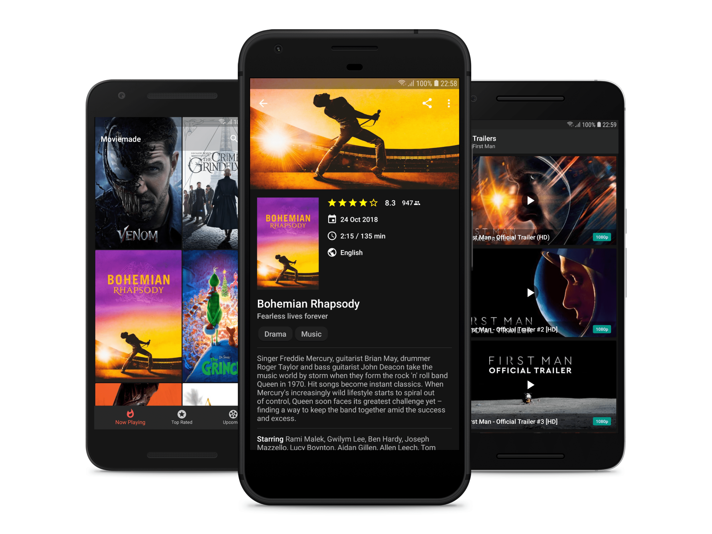
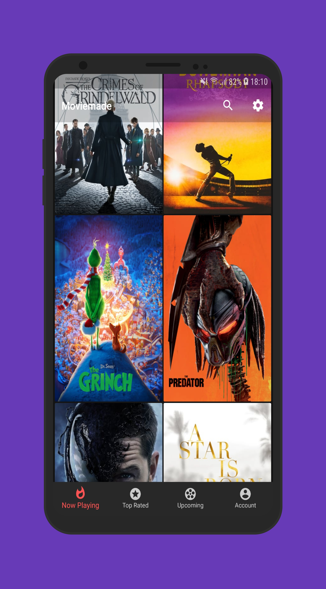
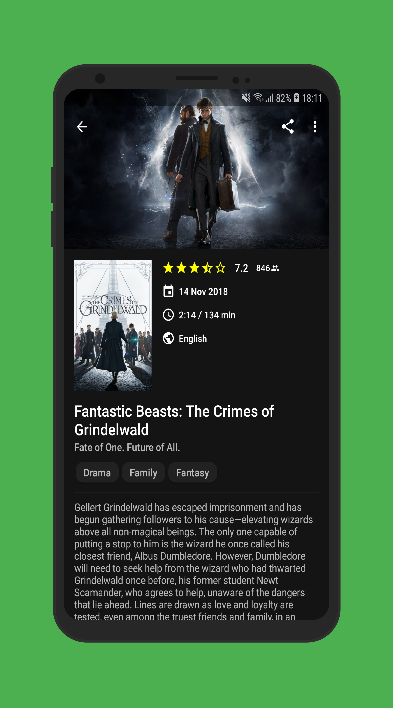
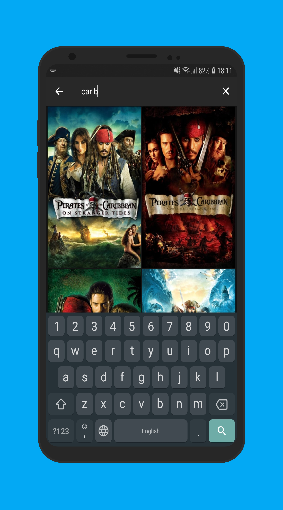
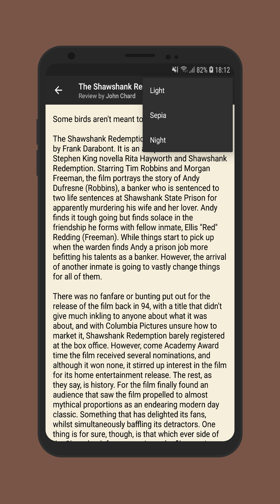

[github]:            https://github.com/michaelbel/moviemade
[paypal-url]:        https://paypal.me/michaelbel
[licence-url]:       http://www.apache.org/licenses/LICENSE-2.0
[googleplay-url]:    https://play.google.com/store/apps/details?id=org.michaelbel.moviemade
[tmdb-introduction]: https://developers.themoviedb.org/3/getting-started/introduction

[platform-badge]:   https://img.shields.io/badge/Platform-Android-F3745F.svg
[paypal-badge]:     https://img.shields.io/badge/Donate-Paypal-F3745F.svg
[license-badge]:    https://img.shields.io/badge/License-Apache_v2.0-F3745F.svg
[googleplay-badge]: https://img.shields.io/badge/Google_Play-Demo-F3745F.svg
[minsdk-badge]:     https://img.shields.io/badge/minSdkVersion-21-F3745F.svg

<!--------------------------------------------------------------------------------------------------------------->



Moviemade
=

[![platform-badge]][github]
[![minsdk-badge]][github]
[![license-badge]][licence-url]
[![paypal-badge]][paypal-url]
[![googleplay-badge]][googleplay-url]

Moviemade - quick and easy way to discover popular movies. This is a simple TMDb client for Android with material design.

## Build
Take a look at <b>`local.properties`</b> and fill it with [your own][tmdb-introduction] <b>tmdb_api_key</b> like this:
```gradle
tmdb_api_key=YOUR_OWN_TMDB_KEY
```

## Download
[](https://play.google.com/store/apps/details?id=org.michaelbel.moviemade)
[](bin/moviemade-v1.0.1-release.apk)

## Screenshots
<div style="dispaly:flex">
    
    
    
    
    
    
</div>

## Demo video
https://www.youtube.com/watch?v=H5auyhQU9fU

## Open-source libraries
* [**Moxy**](https://github.com/Arello-Mobile/Moxy) MVP-architecture
* [**Retrofit**](https://github.com/square/retrofit) for REST API communication
* [**OkHttp**](https://github.com/square/okhttp) for http & logging
* [**Gson**](https://github.com/google/gson) to convert Java Objects into JSON and back
* [**RxJava2**](https://github.com/ReactiveX/RxJava) for Retrofit & background threads
* [**Glide**](https://github.com/bumptech/glide) for image loading
* [**ButterKnife**](https://github.com/JakeWharton/butterknife) for view binding
* [**Dagger2**](https://github.com/google/dagger) for dependency injection
* [**Room**](https://developer.android.com/topic/libraries/architecture/room.html) database
* [**Espresso**](https://google.github.io/android-testing-support-library/docs/espresso/) for UI tests
* [**Kotlin**](https://github.com/JetBrains/kotlin) for simplicity
* [**GestureViews**](https://github.com/alexvasilkov/GestureViews) for gestures control
* [**BottomNavigation**](https://github.com/Ashok-Varma/BottomNavigation) for BottomBar tabs
* [**ChipsLayoutManager**](https://github.com/BelooS/ChipsLayoutManager) for genres
* [**AndroidYouTubePlayer**](https://github.com/PierfrancescoSoffritti/android-youtube-player) for playing videos
* [**AndroidAnimatedMenuItems**](https://github.com/adonixis/android-animated-menu-items) for menu items

## Issues
If you find any problems or would like to suggest a feature, please feel free to file an [issue](https://github.com/michaelbel/moviemade/issues).

## License
<a href="http://www.apache.org/licenses/LICENSE-2.0" target="_blank">
  
</a>

    Copyright 2017 Michael Bely

    Licensed under the Apache License, Version 2.0 (the "License");
    you may not use this file except in compliance with the License.
    You may obtain a copy of the License at

       http://www.apache.org/licenses/LICENSE-2.0

    Unless required by applicable law or agreed to in writing, software
    distributed under the License is distributed on an "AS IS" BASIS,
    WITHOUT WARRANTIES OR CONDITIONS OF ANY KIND, either express or implied.
    See the License for the specific language governing permissions and
    limitations under the License.
