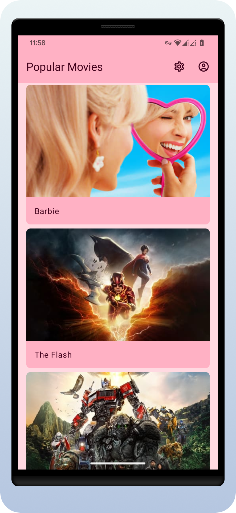
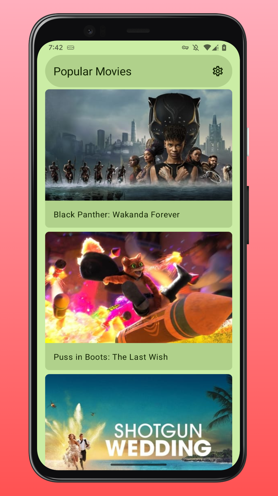

Movies
=

[](https://github.com/michaelbel/movies/actions/workflows/check_pr.yml)
[](https://paypal.me/michaelbel)
[](https://github.com/michaelbel/moviemade/commits)

Movies - easy way to discover popular movies. This is a simple TMDb client for Android

<div style="dispaly:flex">
    
    
    
</div>

## Build

Take a look at <b>`local.properties`</b> and fill it with [your own](https://developers.themoviedb.org/3/getting-started/introduction) <b>tmdb_api_key</b> like this:
```gradle
TMDB_API_KEY=your_own_tmdb_api_key
```

## Download

[](https://play.google.com/store/apps/details?id=org.michaelbel.moviemade)
[](https://github.com/michaelbel/Moviemade/releases/download/1.3.1/moviemade-v1.3.1-release.apk)

## Technologies

- [x] Modularization
- [x] MVVM
- [x] [Clean Architecture](https://d.android.com/topic/architecture)
- [x] [TMDB API](https://developers.themoviedb.org/3/getting-started)
- [x] KTS Gradle Files
- [x] Gradle Plugin 7.4.1
- [x] Gradle Version Catalog
- [x] MinSDK 21
- [x] TargetSDK 33
- [x] CompileSDK 33
- [x] [Material3](https://m3.material.io)
- [x] Dark Theme
- [x] Dynamic Colors
- [x] [Themed App Icon](https://d.android.com/develop/ui/views/launch/icon_design_adaptive)
- [x] 100% Kotlin 1.8.0
- [x] 100% Jetpack Compose 1.3.1, No XML
- [x] [Accompanist](https://github.com/google/accompanist) 0.28.0
- [x] [Compose PreviewParameterProvider](https://d.android.com/jetpack/compose/tooling#previewparameter)
- [x] [Downloadable Fonts](https://d.android.com/develop/ui/views/text-and-emoji/downloadable-fonts)
- [x] [KotlinX Coroutines](https://github.com/Kotlin/kotlinx.coroutines) 1.6.4
- [x] [KotlinX Serialization](https://github.com/Kotlin/kotlinx.serialization) 1.4.1
- [x] [Appcompat](https://d.android.com/jetpack/androidx/releases/appcompat) 1.6.0-rc01
- [x] [Dagger Hilt](https://github.com/google/dagger) 2.45
- [x] [ViewModel](https://d.android.com/topic/libraries/architecture/viewmodel)
- [x] [Lifecycle](https://d.android.com/topic/libraries/architecture/lifecycle) 2.6.0-alpha03
- [x] [Room](https://d.android.com/training/data-storage/room) 2.5.0
- [x] [DataStore](https://d.android.com/datastore) 1.0.0
- [x] [Startup](https://d.android.com/jetpack/androidx/releases/startup) 1.1.1
- [x] [Navigation](https://d.android.com/guide/navigation) 2.5.3
- [x] [Paging](https://d.android.com/topic/libraries/architecture/paging/v3-overview) (RemoteMediator & PagingSource)
- [x] [ConstraintLayout](https://d.android.com/develop/ui/views/layout/constraint-layout)
- [x] [OkHttp](https://github.com/square/okhttp) 4.10.0
- [x] [Retrofit](https://github.com/square/retrofit) 2.9.0
- [x] [Retrofit Kotlinx Converter Serialization](https://github.com/JakeWharton/retrofit2-kotlinx-serialization-converter) 0.8.0
- [x] [Chucker](https://github.com/ChuckerTeam/chucker) 3.5.2
- [x] [Coil](https://github.com/coil-kt/coil) 2.2.2
- [x] [Timber](https://github.com/JakeWharton/timber) 5.0.1
- [x] [Firebase Crashlytics](https://firebase.google.com/products/crashlytics) 18.3.5
- [x] [Firebase App Distribution](https://firebase.google.com/products/app-distribution) 3.2.0
- [x] [Firebase Remote Config](https://firebase.google.com/products/remote-config) 21.2.1
- [x] [Google Analytics for Firebase](https://firebase.google.com/products/analytics) 21.2.0
- [x] [In-App Reviews](https://d.android.com/guide/playcore/in-app-review)
- [x] [App Shortcuts](https://d.android.com/develop/ui/views/launch/shortcuts)
- [x] [Dependabot](https://github.com/dependabot)
- [x] Github Actions CI/CD
- [x] Github Releases
- [x] [Lint](https://d.android.com/studio/write/lint)
- [x] [Detekt](https://github.com/detekt/detekt) 1.22.0
- [x] [Spotless](https://github.com/diffplug/spotless) 6.15.0
- [x] Distribute App via Telegram Bot
- [x] Non-Transitive R classes
- [x] [SplashScreen API](https://d.android.com/develop/ui/views/launch/splash-screen)
- [x] [Per-App Language Preferences](https://d.android.com/guide/topics/resources/app-languages)
- [x] [Settings Panel](https://d.android.com/reference/android/provider/Settings.Panel)
- [x] [Benchmark](https://d.android.com/topic/performance/benchmarking/benchmarking-overview)
- [ ] Deep Links
- [ ] Unit Tests
- [ ] UI Tests (in progress)
- [ ] [In-App Updates](https://d.android.com/guide/playcore/in-app-updates)
- [ ] [Google Admob](https://developers.google.com/admob)
- [ ] [WorkManager](https://d.android.google.cn/topic/libraries/architecture/workmanager)
- [ ] [KtLint](https://github.com/pinterest/ktlint)
- [ ] [Support Display Cutouts](https://d.android.com/develop/ui/views/layout/display-cutout)
- [ ] [Baseline Profiles](https://d.android.com/topic/performance/baselineprofiles/overview)
- [ ] [Tablet and large screen support](https://d.android.com/about/versions/13/features/large-screens)
- [ ] OAuth
- [ ] Animations
- [ ] Landscape Orientation
- [ ] Support RTL (in progress)
- [ ] Upload Bundle to Google Play Console
- [ ] ExoPlayer
- [ ] Documentation

## Issues
If you find any problems or would like to suggest a feature, please feel free to file an [issue](https://github.com/michaelbel/moviemade/issues).

## License
<a href="http://www.apache.org/licenses/LICENSE-2.0" target="_blank">
  
</a>

    Copyright 2017 Michael Bely

    Licensed under the Apache License, Version 2.0 (the "License");
    you may not use this file except in compliance with the License.
    You may obtain a copy of the License at

       http://www.apache.org/licenses/LICENSE-2.0

    Unless required by applicable law or agreed to in writing, software
    distributed under the License is distributed on an "AS IS" BASIS,
    WITHOUT WARRANTIES OR CONDITIONS OF ANY KIND, either express or implied.
    See the License for the specific language governing permissions and
    limitations under the License.
