Movies
=

[](https://github.com/michaelbel/movies/actions/workflows/check_pr.yml)
[](https://play.google.com/store/apps/details?id=org.michaelbel.moviemade)
[](https://paypal.me/michaelbel)
[](https://github.com/michaelbel/moviemade/commits)

Movies - easy way to discover popular movies. This is a simple TMDb client for Android

<div style="dispaly:flex">
    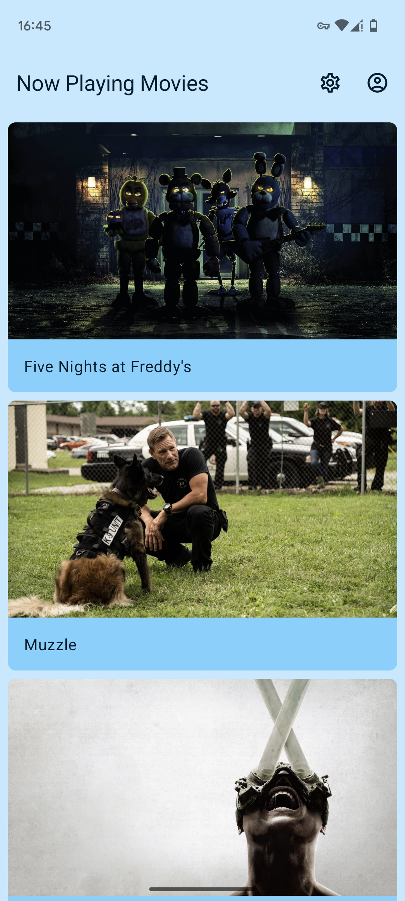
    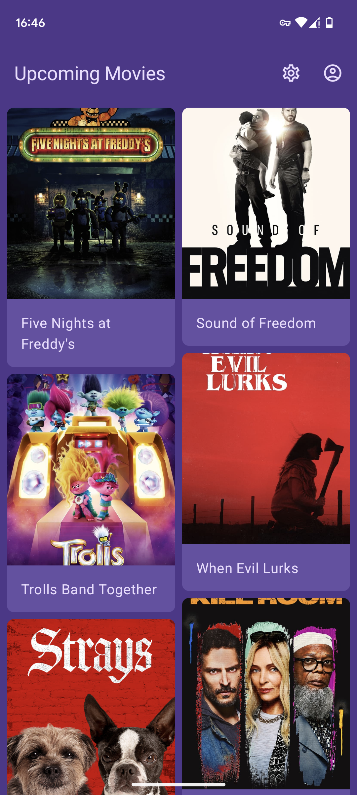
    
    
    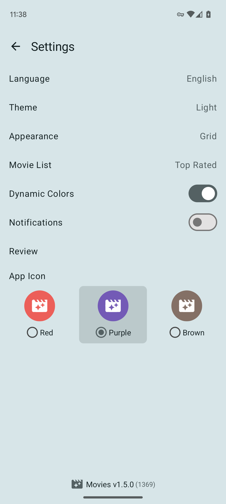
    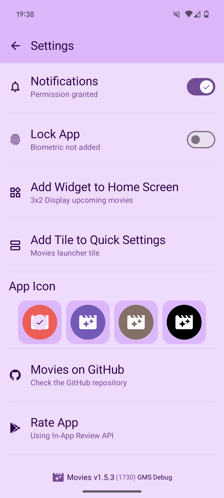
    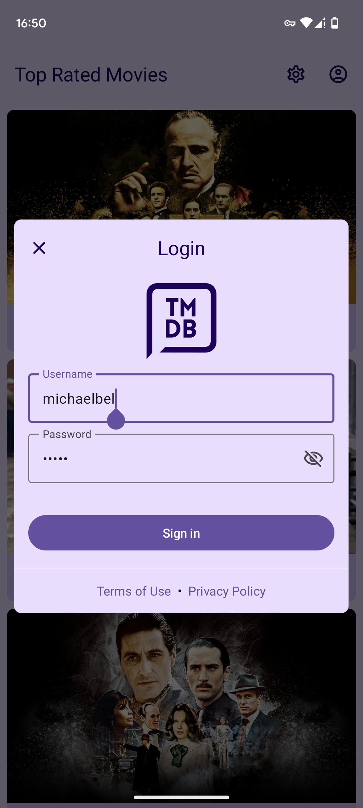
    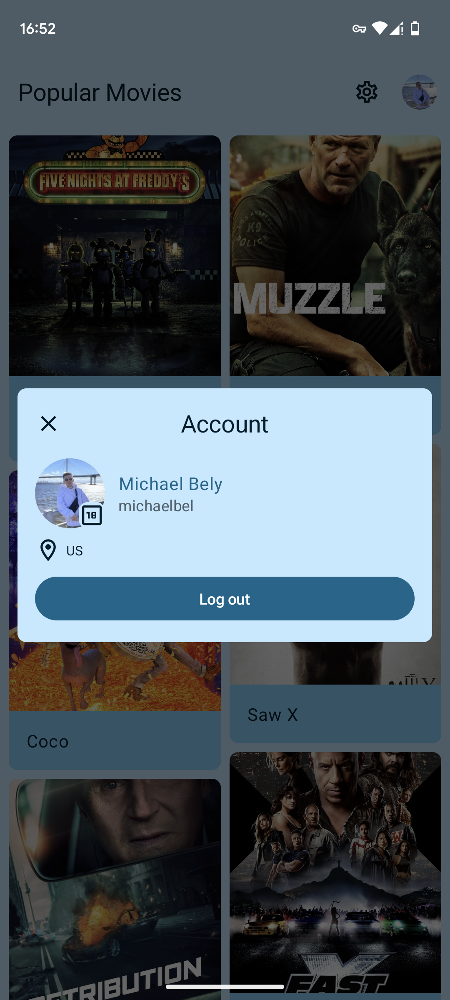
    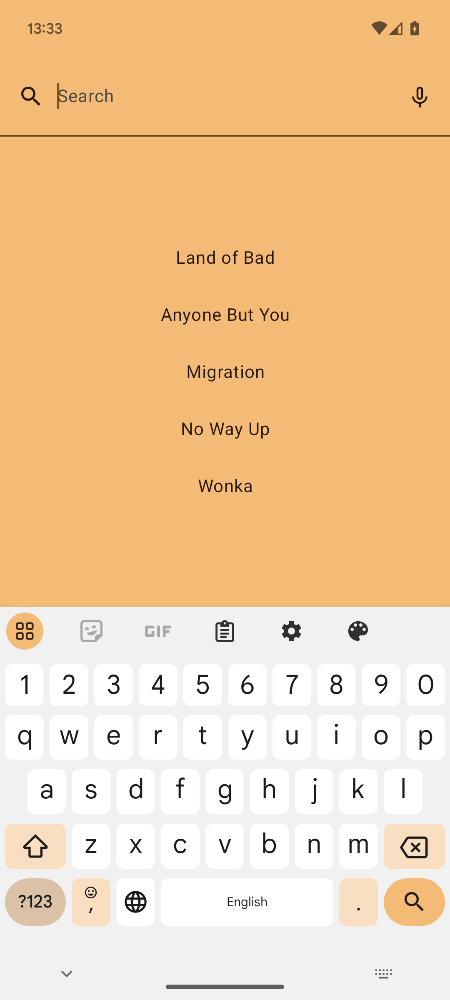
    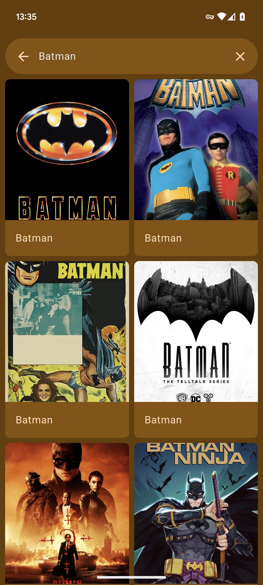
    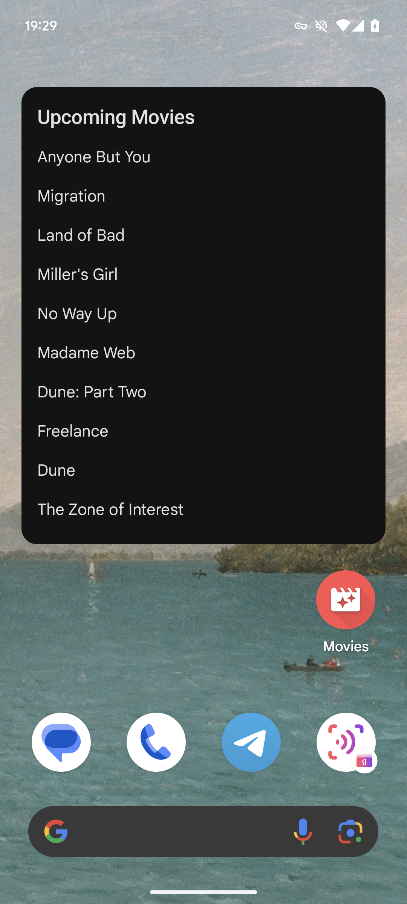
    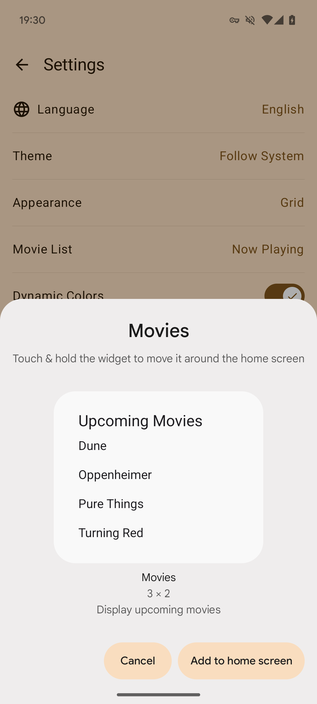
    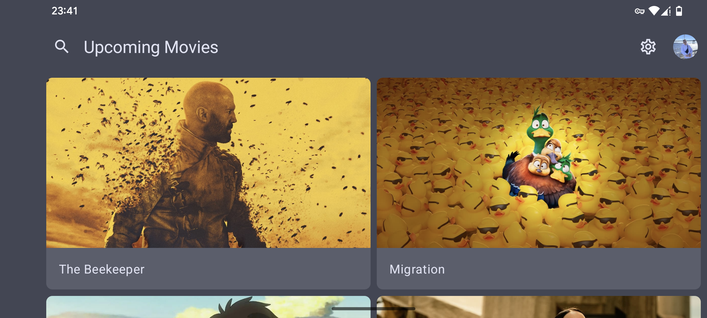
    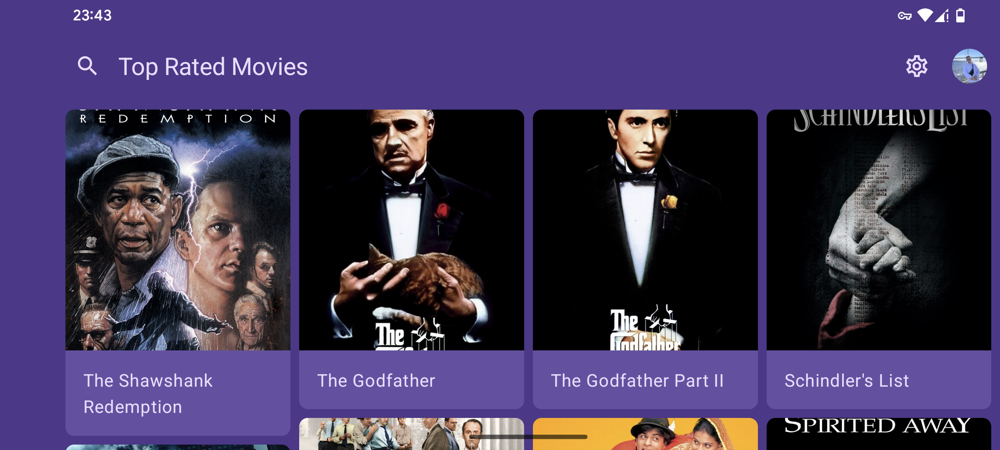
</div>

## Build

Take a look at <b>`local.properties`</b> and fill it with [your own](https://developers.themoviedb.org/3/getting-started/introduction) <b>tmdb_api_key</b> like this:
```gradle
TMDB_API_KEY=your_own_tmdb_api_key
```

## Download

[](https://play.google.com/store/apps/details?id=org.michaelbel.moviemade)
[](https://appgallery.cloud.huawei.com/ag/n/app/C109677247)
[](https://github.com/michaelbel/movies/releases/download/1.5.3/Movies-v1.5.3.1478.-gms-release.apk)
[](https://apps.obtainium.imranr.dev/redirect?r=obtainium://add/https://github.com/michaelbel/movies)

## Technologies

- [x] [Modularization](https://d.android.com/topic/modularization)
- [x] [MVVM](https://d.android.com/topic/architecture)
- [x] [Clean Architecture](https://d.android.com/topic/architecture)
- [x] [TMDB API](https://developers.themoviedb.org/3/getting-started)
- [x] [KTS Gradle Files](https://d.android.com/studio/build/migrate-to-kts)
- [x] [Kotlin Symbol Processing API](https://d.android.com/studio/build/migrate-to-ksp)
- [x] [Gradle Plugin](https://d.android.com/studio/releases/gradle-plugin)
- [x] [Gradle Version Catalog](https://d.android.com/build/migrate-to-catalogs)
- [x] [Build Variants](https://d.android.com/build/build-variants)
- [x] [Product Flavors](https://d.android.com/build/build-variants#product-flavors)
- [x] MinSDK 23
- [x] TargetSDK 34
- [x] CompileSDK 34
- [x] [Material3](https://m3.material.io)
- [x] [Dark Theme](https://d.android.com/develop/ui/views/theming/darktheme)
- [x] Amoled Theme
- [x] [Material You Dynamic Colors](https://d.android.com/develop/ui/views/theming/dynamic-colors)
- [x] [Themed App Icon](https://d.android.com/develop/ui/views/launch/icon_design_adaptive)
- [x] [Palette Colors API](https://d.android.com/develop/ui/views/graphics/palette-colors)
- [x] [Kotlin](https://d.android.com/kotlin)
- [x] [Jetpack Compose](https://d.android.com/jetpack/compose)
- [x] [Accompanist](https://github.com/google/accompanist)
- [x] [Compose PreviewParameterProvider](https://d.android.com/jetpack/compose/tooling#previewparameter)
- [x] [Downloadable Fonts](https://d.android.com/develop/ui/views/text-and-emoji/downloadable-fonts)
- [x] [KotlinX Coroutines](https://github.com/Kotlin/kotlinx.coroutines)
- [x] [KotlinX Serialization](https://github.com/Kotlin/kotlinx.serialization)
- [x] [Appcompat](https://d.android.com/jetpack/androidx/releases/appcompat)
- [x] [Dagger Hilt](https://github.com/google/dagger)
- [x] [ViewModel](https://d.android.com/topic/libraries/architecture/viewmodel)
- [x] [Lifecycle](https://d.android.com/topic/libraries/architecture/lifecycle)
- [x] [Room](https://d.android.com/training/data-storage/room)
- [x] [WorkManager](https://d.android.com/topic/libraries/architecture/workmanager)
- [x] [DataStore](https://d.android.com/datastore)
- [x] [Startup](https://d.android.com/jetpack/androidx/releases/startup)
- [x] [Navigation](https://d.android.com/guide/navigation)
- [x] [Paging3](https://d.android.com/topic/libraries/architecture/paging/v3-overview)
- [x] [ConstraintLayout](https://d.android.com/develop/ui/views/layout/constraint-layout)
- [x] [Browser](https://d.android.com/jetpack/androidx/releases/browser)
- [x] [OkHttp](https://github.com/square/okhttp)
- [x] [Retrofit](https://github.com/square/retrofit)
- [x] [Retrofit Kotlinx Converter Serialization](https://github.com/JakeWharton/retrofit2-kotlinx-serialization-converter)
- [x] [Chucker](https://github.com/ChuckerTeam/chucker)
- [x] [Flaker](https://github.com/rotbolt/flaker)
- [x] [Coil](https://github.com/coil-kt/coil)
- [x] [Timber](https://github.com/JakeWharton/timber)
- [x] [Firebase Analytics](https://firebase.google.com/products/analytics)
- [x] [Firebase Crashlytics](https://firebase.google.com/products/crashlytics)
- [x] [Firebase App Distribution](https://firebase.google.com/products/app-distribution)
- [x] [Firebase Remote Config](https://firebase.google.com/products/remote-config)
- [x] [Firebase Messaging](https://firebase.google.com/products/cloud-messaging)
- [x] [In-App Reviews](https://d.android.com/guide/playcore/in-app-review)
- [x] [In-App Updates](https://d.android.com/guide/playcore/in-app-updates)
- [x] [App Shortcuts](https://d.android.com/develop/ui/views/launch/shortcuts)
- [x] [Dependabot](https://github.com/dependabot)
- [x] [Github Actions](https://github.com/michaelbel/movies/tree/develop/.github/workflows)
- [x] [Github Releases](https://github.com/michaelbel/movies/releases)
- [x] [Lint](https://d.android.com/studio/write/lint)
- [x] [Detekt](https://github.com/detekt/detekt)
- [x] [Spotless](https://github.com/diffplug/spotless)
- [x] [Distribute App via Telegram Bot](https://github.com/appleboy/telegram-action)
- [x] [Non-Transitive R classes](https://d.android.com/studio/build/optimize-your-build#use-non-transitive-r-classes)
- [x] [SplashScreen API](https://d.android.com/develop/ui/views/launch/splash-screen)
- [x] [Per-App Language Preferences](https://d.android.com/guide/topics/resources/app-languages)
- [x] [Settings Panel](https://d.android.com/reference/android/provider/Settings.Panel)
- [x] [Benchmark](https://d.android.com/topic/performance/benchmarking/benchmarking-overview)
- [x] [Support Localization](https://d.android.com/guide/topics/resources/localization)
- [x] [Notification Runtime Permission](https://d.android.com/develop/ui/views/notifications/notification-permission)
- [x] [Changing Launcher App Icon](https://d.android.com/guide/topics/manifest/activity-alias-element)
- [x] [Predictive Back Gesture](https://d.android.com/guide/navigation/custom-back/predictive-back-gesture)
- [x] [Codebeat Automated Code Review](https://codebeat.co/projects/github-com-michaelbel-movies-develop)
- [x] [Codacy Static Code Analysis](https://app.codacy.com/gh/michaelbel/movies/dashboard)
- [x] [Display Content Edge-to-Edge](https://d.android.com/develop/ui/views/layout/edge-to-edge)
- [x] [Support Landscape Orientation](https://d.android.com/guide/topics/large-screens/support-different-screen-sizes)
- [x] [Support Display Cutouts](https://d.android.com/jetpack/compose/system/cutouts)
- [x] [Voice Input](https://d.android.com/training/wearables/user-input/voice)
- [x] [User Interactions](https://d.android.com/jetpack/compose/text/user-interactions)
- [x] [Glance AppWidget](https://d.android.com/jetpack/compose/glance)
- [x] [Grammatical Gender](https://d.android.com/about/versions/14/features/grammatical-inflection)

## Roadmap
[Movies App Roadmap](https://github.com/users/michaelbel/projects/1/views/1)

## Issues
If you find any problems or would like to suggest a feature, please feel free to file an [issue](https://github.com/michaelbel/moviemade/issues).

## Star History
<a href="https://star-history.com/#michaelbel/movies&Date">
  <picture>
    <source media="(prefers-color-scheme: dark)" srcset="https://api.star-history.com/svg?repos=michaelbel/movies&type=Date&theme=dark" />
    <source media="(prefers-color-scheme: light)" srcset="https://api.star-history.com/svg?repos=michaelbel/movies&type=Date" />
    
  </picture>
</a>

## License
<a href="http://www.apache.org/licenses/LICENSE-2.0" target="_blank">
  
</a>

    Copyright 2017 Michael Bely

    Licensed under the Apache License, Version 2.0 (the "License");
    you may not use this file except in compliance with the License.
    You may obtain a copy of the License at

       http://www.apache.org/licenses/LICENSE-2.0

    Unless required by applicable law or agreed to in writing, software
    distributed under the License is distributed on an "AS IS" BASIS,
    WITHOUT WARRANTIES OR CONDITIONS OF ANY KIND, either express or implied.
    See the License for the specific language governing permissions and
    limitations under the License.
