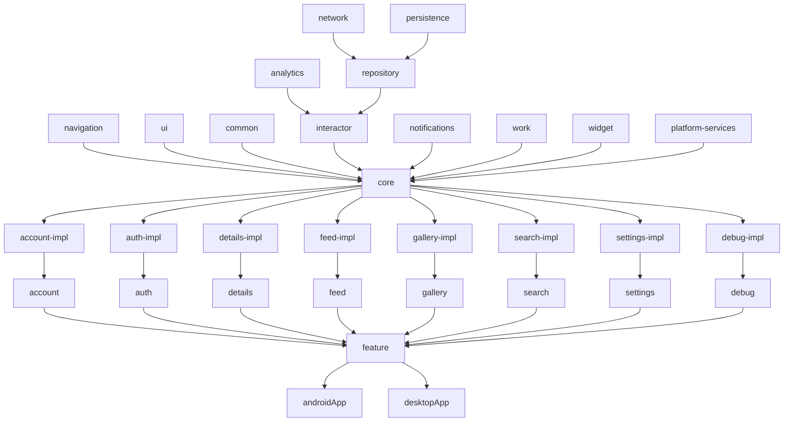

[]()
<div align="right">
    <a href="https://github.com/michaelbel/movies/blob/develop/readme.md"><b>en</b></a>
    <a href="https://github.com/michaelbel/movies/blob/develop/readme.ru.md">ru</a>
</div>

<br/>
<br/>
<br/>
<br/>

Movies
=

[](https://github.com/michaelbel/movies)
<!-- [](https://github.com/michaelbel/movies)
[](https://github.com/michaelbel/movies)
[](https://github.com/michaelbel/movies)
[](https://github.com/michaelbel/movies)
[](https://github.com/michaelbel/movies)
[](https://github.com/michaelbel/movies)
[](https://github.com/michaelbel/movies) -->

[](https://github.com/michaelbel/movies/actions/workflows/check_pr.yml)
[](https://github.com/michaelbel/movies/commits)

Movies - easy way to discover popular movies. This is a simple TMDb client.

The goal of this project is to implement an app that provides a consistent user experience on Android Phones, Android Tablets, Android Auto, Android Wear, Android TV, iOS, Desktop (MacOS, Windows, Linux) and Web. Used Material3, Compose, Kotlin and Multiplatform.

The app is currently in development. Android app is already available.


## Screenshots
<p align="center">
    
    
    
    
    
    
    
    
    
    
</p>


## Requirements
Take a look at <b>`local.properties`</b> and fill it with [your own](https://developers.themoviedb.org/3/getting-started/introduction) <b>TMDB API key</b> like this:
```gradle
TMDB_API_KEY=your_own_tmdb_api_key
 ```
The app is still usable without an API key. In this case functionality will be limited.


## Build
- Clone this repository using [latest version](https://d.android.com/studio) of Android Studio
- Run the app on your device or emulator
    - 🤖 **Android** with Google Mobile Services:
      ```gradle
      ./gradlew :androidApp:installGmsDebug
      ```
    - 🤖 **Android** with Huawei Mobile Services:
      ```gradle
      ./gradlew :androidApp:installHmsDebug
      ```
    - 🤖 **Android** Free and Open Source Software:
      ```gradle
      ./gradlew :androidApp:installFossDebug
      ```


## Download
[](https://play.google.com/store/apps/details?id=org.michaelbel.moviemade)
[](https://github.com/michaelbel/movies/releases)

[](https://play.google.com/store/apps/details?id=org.michaelbel.moviemade)
[](https://appgallery.cloud.huawei.com/ag/n/app/C109677247)
[](https://github.com/michaelbel/movies/releases/download/2.0.0/Movies-v2.0.0.1699.-gms-release.apk)
[](https://apps.obtainium.imranr.dev/redirect?r=obtainium://add/https://github.com/michaelbel/movies)


## Technologies
[](https://git-scm.com)
[](https://d.android.com/kotlin)
[![Ktor](https://img.shields.io/badge/Ktor-7f52ff?&style=for-the-badge&logo=data:image/svg+xml;base64,PHN2ZyB4bWxucz0iaHR0cDovL3d3dy53My5vcmcvMjAwMC9zdmciIHZpZXdCb3g9IjAgMCAxMjggMTI4Ij4KICA8ZGVmcyBmaWxsPSIjN2Y1MmZmIj4KICAgIDxsaW5lYXJHcmFkaWVudCBpZD0iYSIgeDE9IjI0Ljk0MSIgeDI9IjUyLjMwNiIgeTE9IjI0Ljk0MSIgeTI9IjUyLjMwNiIgZ3JhZGllbnRUcmFuc2Zvcm09InJvdGF0ZSguMTA0KSBzY2FsZSgxLjIxOTA1KSIgZ3JhZGllbnRVbml0cz0idXNlclNwYWNlT25Vc2UiIGZpbGw9IiM3ZjUyZmYiPgogICAgICA8c3RvcCBvZmZzZXQ9Ii4yOTYiIHN0b3AtY29sb3I9IiNmZmZmZmYiIGZpbGw9IiM3ZjUyZmYiLz4KICAgICAgPHN0b3Agb2Zmc2V0PSIuNjk0IiBzdG9wLWNvbG9yPSIjZmZmZmZmIiBmaWxsPSIjN2Y1MmZmIi8+CiAgICAgIDxzdG9wIG9mZnNldD0iMSIgc3RvcC1jb2xvcj0iI2ZmZmZmZiIgZmlsbD0iIzdmNTJmZiIvPgogICAgPC9saW5lYXJHcmFkaWVudD4KICAgIDxsaW5lYXJHcmFkaWVudCBpZD0iYiIgeDE9IjUzLjE1MSIgeDI9Ijc5LjAyMyIgeTE9IjUzLjE1MSIgeTI9Ijc5LjAyMyIgZ3JhZGllbnRUcmFuc2Zvcm09InJvdGF0ZSguMTA0KSBzY2FsZSgxLjIxOTA1KSIgZ3JhZGllbnRVbml0cz0idXNlclNwYWNlT25Vc2UiIGZpbGw9IiM3ZjUyZmYiPgogICAgICA8c3RvcCBvZmZzZXQ9Ii4xMDgiIHN0b3AtY29sb3I9IiNmZmZmZmYiIGZpbGw9IiM3ZjUyZmYiLz4KICAgICAgPHN0b3Agb2Zmc2V0PSIuMTczIiBzdG9wLWNvbG9yPSIjZmZmZmZmIiBmaWxsPSIjN2Y1MmZmIi8+CiAgICAgIDxzdG9wIG9mZnNldD0iLjQ5MiIgc3RvcC1jb2xvcj0iI2ZmZmZmZiIgZmlsbD0iIzdmNTJmZiIvPgogICAgICA8c3RvcCBvZmZzZXQ9Ii43MTYiIHN0b3AtY29sb3I9IiNmZmZmZmYiIGZpbGw9IiM3ZjUyZmYiLz4KICAgICAgPHN0b3Agb2Zmc2V0PSIuODIzIiBzdG9wLWNvbG9yPSIjZmZmZmZmIiBmaWxsPSIjN2Y1MmZmIi8+CiAgICA8L2xpbmVhckdyYWRpZW50PgogIDwvZGVmcz4KICA8cGF0aCBmaWxsPSJ1cmwoI2EpIiBkPSJNODAuNDU3IDQ3LjU0MyA0Ny41NDMgMTQuNjI5IDE0LjYyOSA0Ny41NDNsMzIuOTE0IDMyLjkxNFptMCAwIi8+CiAgPHBhdGggZmlsbD0idXJsKCNiKSIgZD0ibTQ3LjU0MyA4MC40NTcgMzIuOTE0IDMyLjkxNCAzMi45MTQtMzIuOTE0LTMyLjkxNC0zMi45MTRabTAgMCIvPgogIDxwYXRoIGQ9Ik04MC40NTcgNDcuNTQzSDQ3LjU0M3YzMi45MTRoMzIuOTE0Wm0wIDAiIGZpbGw9IiM3ZjUyZmYiLz4KPC9zdmc+&logoColor=white)](https://ktor.io)
[](https://d.android.com/jetpack/compose)
[![Material3](https://img.shields.io/badge/Material3-004A76?&style=for-the-badge&logo=data:image/svg+xml;base64,PHN2ZyB4bWxucz0iaHR0cDovL3d3dy53My5vcmcvMjAwMC9zdmciIHdpZHRoPSI4MDBweCIgaGVpZ2h0PSI4MDBweCIgdmlld0JveD0iMCAwIDI0IDI0Ij4KICA8dGl0bGU+bWF0ZXJpYWxfZGVzaWduPC90aXRsZT4KICA8cmVjdCB3aWR0aD0iMjQiIGhlaWdodD0iMjQiIGZpbGw9Im5vbmUiLz4KICA8cGF0aCBkPSJNMjEsMTJhOSw5LDAsMCwwLTItNS42MlYxNy42M0E4Ljc4LDguNzgsMCwwLDAsMjEsMTJtLTMuMzcsN0g2LjM4YTkuNSw5LjUsMCwwLDAsMi42NywxLjQxQTguOTEsOC45MSwwLDAsMCwxMiwyMSw4Ljg2LDguODYsMCwwLDAsMTUsMjAuNDEsOS43Miw5LjcyLDAsMCwwLDE3LjYzLDE5TTExLDE3LDcsOXY4aDRtNi04LTQsOGg0VjltLTUsNS41M0wxNS43NSw3SDguMjVMMTIsMTQuNTNNMTcuNjMsNUE4LjkxLDguOTEsMCwwLDAsNi4zOCw1SDE3LjYzTTUsMTcuNjNWNi4zOEE5LDksMCwwLDAsMywxMmE4Ljc4LDguNzgsMCwwLDAsMiw1LjYzTTIzLDEyYTEwLjU3LDEwLjU3LDAsMCwxLTMuMjIsNy43OEExMC41NywxMC41NywwLDAsMSwxMiwyM2ExMC41OSwxMC41OSwwLDAsMS03Ljc4LTMuMjJBMTAuNTcsMTAuNTcsMCwwLDEsMSwxMiwxMC41OSwxMC41OSwwLDAsMSw0LjIyLDQuMjIsMTAuNTksMTAuNTksMCwwLDEsMTIsMWExMC41NywxMC41NywwLDAsMSw3Ljc4LDMuMjJBMTAuNTksMTAuNTksMCwwLDEsMjMsMTJaIiBmaWxsPSIjZmZmZmZmIi8+Cjwvc3ZnPg==&logoColor=white)](https://m3.material.io)
[](https://d.android.com/studio/releases/gradle-plugin)
[](https://d.android.com)
[](https://firebase.google.com)
[![Coil](https://img.shields.io/badge/Coil-3B6BB4?&style=for-the-badge&logo=data:image/svg+xml;base64,PHN2ZyB4bWxucz0iaHR0cDovL3d3dy53My5vcmcvMjAwMC9zdmciIHZlcnNpb249IjEuMSIgaWQ9IkxheWVyXzEiIHg9IjBweCIgeT0iMHB4IiB3aWR0aD0iMjAwcHgiIGhlaWdodD0iMjAwcHgiIHZpZXdCb3g9IjMzMi41IDIwMCAxNDAgMTQwIiB4bWw6c3BhY2U9InByZXNlcnZlIj4KPGc+Cgk8Zz4KCQk8cGF0aCBmaWxsPSIjZmZmZmZmIiBkPSJNMzkyLjcyOCwzMDMuMzgybC0zMi4zODQtMjQuMjQxbC0zLjI0MywyLjQzMWMtNS41MjMsNC4xMzEtNS41MjMsMTAuODM3LDAsMTQuOTdsMzUuNjI3LDI2LjY3MiAgICBjNS41MjUsNC4xMzIsMTQuNDc4LDQuMTMyLDIwLjAwMiwwbDM1LjYyNy0yNi42NzJjNS41MjYtNC4xMzMsNS41MjYtMTAuODM5LDAtMTQuOTdsLTMuMjQ2LTIuNDMxbC0zMi4zODEsMjQuMjQxICAgIEM0MDcuMjA2LDMwNy41MTUsMzk4LjI1MywzMDcuNTE1LDM5Mi43MjgsMzAzLjM4MnoiLz4KCQk8cGF0aCBmaWxsPSIjZmZmZmZmIiBkPSJNNDQ4LjM1NywyNjEuNzQybC0zLjI0Ni0yLjQzbC0zMi4zODEsMjQuMjM4Yy01LjUyNSw0LjEzMy0xNC40NzgsNC4xMzMtMjAuMDAyLDBsLTMyLjM4NC0yNC4yMzggICAgbC0zLjI0MywyLjQzYy01LjUyMyw0LjEzMS01LjUyMywxMC44MzUsMCwxNC45NzFsMy4yNDMsMi40MjhsMzIuMzg0LDI0LjI0MWM1LjUyNSw0LjEzMywxNC40NzgsNC4xMzMsMjAuMDAyLDBsMzIuMzgxLTI0LjI0MSAgICBsMy4yNDYtMi40MjhDNDUzLjg4NCwyNzIuNTc3LDQ1My44ODQsMjY1Ljg3Myw0NDguMzU3LDI2MS43NDJ6Ii8+CgkJPHBhdGggZmlsbD0iI2ZmZmZmZiIgZD0iTTQxMi43MywyODMuNTUxbDMyLjM4MS0yNC4yMzhsMy4yNDYtMi40MzJjNS41MjYtNC4xMzEsNS41MjYtMTAuODM3LDAtMTQuOTcxbC0yLjk4My0yLjIzMiAgICBsLTM3LjMzOCwyNy44NDNjLTIuOTMyLDIuMTk2LTcuNjg1LDIuMTk2LTEwLjYxNSwwbC0xOC45MTEtMTQuMTVjLTIuOTMxLTIuMTk1LTIuOTMxLTUuNzUyLDAtNy45NDhsMzcuOTEtMjcuNDE5bC0zLjY4OS0yLjc2MSAgICBjLTUuNTI1LTQuMTM2LTE0LjQ3OC00LjEzNi0yMC4wMDIsMGwtMzUuNjI3LDI2LjY2OGMtNS41MjMsNC4xMzMtNS41MjMsMTAuODQsMCwxNC45NzFsMy4yNDMsMi40MzJsMzIuMzg0LDI0LjIzOCAgICBDMzk4LjI1MywyODcuNjg0LDQwNy4yMDYsMjg3LjY4NCw0MTIuNzMsMjgzLjU1MXoiLz4KCTwvZz4KPC9nPgo8L3N2Zz4=&logoColor=white)](https://github.com/coil-kt/coil)
[](https://d.android.com/kotlin/multiplatform/room)
[](https://d.android.com/topic/architecture)
[](https://github.com/dependabot)
[](https://github.com/michaelbel/movies/tree/develop/.github/workflows)
[](https://codebeat.co/projects/github-com-michaelbel-movies-develop)

- [x] [Modularization](https://d.android.com/topic/modularization)
- [x] [MVVM](https://d.android.com/topic/architecture)
- [x] [TMDB API](https://developers.themoviedb.org/3/getting-started)
- [x] [KTS Gradle Files](https://d.android.com/studio/build/migrate-to-kts)
- [x] [Kotlin Symbol Processing API](https://d.android.com/studio/build/migrate-to-ksp)
- [x] [Gradle Version Catalog](https://d.android.com/build/migrate-to-catalogs)
- [x] [Build Variants](https://d.android.com/build/build-variants)
- [x] [Product Flavors](https://d.android.com/build/build-variants#product-flavors)
- [x] [Using buildSrc Directory](https://docs.gradle.org/current/userguide/organizing_gradle_projects.html#sec:build_sources)
- [x] MinSDK 23
- [x] TargetSDK 34
- [x] CompileSDK 34
- [x] [Dark Theme](https://d.android.com/develop/ui/views/theming/darktheme)
- [x] Amoled Theme
- [x] [Material You Dynamic Colors](https://d.android.com/develop/ui/views/theming/dynamic-colors)
- [x] [Themed App Icon](https://d.android.com/develop/ui/views/launch/icon_design_adaptive)
- [x] [Palette Colors API](https://d.android.com/develop/ui/views/graphics/palette-colors)
- [x] [Accompanist](https://github.com/google/accompanist)
- [x] [Compose PreviewParameterProvider](https://d.android.com/jetpack/compose/tooling#previewparameter)
- [x] [Downloadable Fonts](https://d.android.com/develop/ui/views/text-and-emoji/downloadable-fonts)
- [x] [KotlinX Coroutines](https://github.com/Kotlin/kotlinx.coroutines)
- [x] [KotlinX Serialization](https://github.com/Kotlin/kotlinx.serialization)
- [x] [Appcompat](https://d.android.com/jetpack/androidx/releases/appcompat)
- [x] [ViewModel](https://d.android.com/topic/libraries/architecture/viewmodel)
- [x] [Lifecycle](https://d.android.com/topic/libraries/architecture/lifecycle)
- [x] [WorkManager](https://d.android.com/topic/libraries/architecture/workmanager)
- [x] [DataStore](https://d.android.com/datastore)
- [x] [Startup](https://d.android.com/jetpack/androidx/releases/startup)
- [x] [Navigation](https://d.android.com/guide/navigation)
- [x] [Paging3](https://d.android.com/topic/libraries/architecture/paging/v3-overview)
- [x] [Browser](https://d.android.com/jetpack/androidx/releases/browser)
- [x] [OkHttp](https://github.com/square/okhttp)
- [x] [Chucker](https://github.com/ChuckerTeam/chucker)
- [x] [Flaker](https://github.com/rotbolt/flaker)
- [x] [Timber](https://github.com/JakeWharton/timber)
- [x] [In-App Reviews](https://d.android.com/guide/playcore/in-app-review)
- [x] [In-App Updates](https://d.android.com/guide/playcore/in-app-updates)
- [x] [App Shortcuts](https://d.android.com/develop/ui/views/launch/shortcuts)
- [x] [Github Releases](https://github.com/michaelbel/movies/releases)
- [x] [Lint](https://d.android.com/studio/write/lint)
- [x] [Detekt](https://github.com/detekt/detekt)
- [x] [Spotless](https://github.com/diffplug/spotless)
- [x] [Distribute App via Telegram Bot](https://github.com/appleboy/telegram-action)
- [x] [Non-Transitive R classes](https://d.android.com/studio/build/optimize-your-build#use-non-transitive-r-classes)
- [x] [SplashScreen API](https://d.android.com/develop/ui/views/launch/splash-screen)
- [x] [Per-App Language Preferences](https://d.android.com/guide/topics/resources/app-languages)
- [x] [Settings Panel](https://d.android.com/reference/android/provider/Settings.Panel)
- [x] [Benchmark](https://d.android.com/topic/performance/benchmarking/benchmarking-overview)
- [x] [Support Localization](https://d.android.com/guide/topics/resources/localization)
- [x] [Notification Runtime Permission](https://d.android.com/develop/ui/views/notifications/notification-permission)
- [x] [Changing Launcher App Icon](https://d.android.com/guide/topics/manifest/activity-alias-element)
- [x] [Predictive Back Gesture](https://d.android.com/guide/navigation/custom-back/predictive-back-gesture)
- [x] [Codacy Static Code Analysis](https://app.codacy.com/gh/michaelbel/movies/dashboard)
- [x] [Display Content Edge-to-Edge](https://d.android.com/develop/ui/views/layout/edge-to-edge)
- [x] [Support Landscape Orientation](https://d.android.com/guide/topics/large-screens/support-different-screen-sizes)
- [x] [Support Display Cutouts](https://d.android.com/jetpack/compose/system/cutouts)
- [x] [Voice Input](https://d.android.com/training/wearables/user-input/voice)
- [x] [User Interactions](https://d.android.com/jetpack/compose/text/user-interactions)
- [x] [Glance AppWidget](https://d.android.com/jetpack/compose/glance)
- [x] [Tile Quick Settings](https://d.android.com/develop/ui/views/quicksettings-tiles)
- [x] [Grammatical Gender](https://d.android.com/about/versions/14/features/grammatical-inflection)
- [x] [Biometric Authentication Dialog](https://d.android.com/training/sign-in/biometric-auth)
- [x] [LeakCanary](https://github.com/square/leakcanary)
- [x] [ConstraintLayout Multiplatform](https://github.com/Lavmee/constraintlayout-compose-multiplatform)
- [x] [PreCompose](https://github.com/Tlaster/PreCompose)
- [x] [Koin](https://github.com/InsertKoinIO/koin)
- [x] [Screenshot Detection](https://d.android.com/about/versions/14/features/screenshot-detection)
- [x] [ConstraintLayout](https://d.android.com/develop/ui/views/layout/constraint-layout) removed in [44723cb](https://github.com/michaelbel/movies/commit/44723cbbafdad89bef6043f99cbd0fbab1ecf19a)
- [x] [Dagger Hilt](https://github.com/google/dagger) removed in [#274](https://github.com/michaelbel/movies/pull/274)
- [x] [Retrofit](https://github.com/square/retrofit) removed in [#275](https://github.com/michaelbel/movies/pull/275)


## Modules



## Roadmap
[Movies App Roadmap](https://github.com/users/michaelbel/projects/1/views/1)


## Contributing
[](https://github.com/michaelbel/movies/pulls)

All contributions are welcome!

⭐ Join [stargazers](https://github.com/michaelbel/movies/stargazers)  
↗️ Submit your PR


## Issues
[](https://github.com/michaelbel/movies/issues)

If you find any problems or would like to suggest a feature, please feel free to file an [issue](https://github.com/michaelbel/movies/issues).


## Contacts
[](https://t.me/michaelbel)
[](https://linkedin.com/in/michael-bel)
[](mailto:michaelvel24865@gmail.com)
[](https://instagram.com/michael_bel)
[](https://x.com/michael_bely)


## Star History
<a href="https://star-history.com/#michaelbel/movies&Date">
  <picture>
    <source media="(prefers-color-scheme: dark)" srcset="https://api.star-history.com/svg?repos=michaelbel/movies&type=Date&theme=dark" />
    <source media="(prefers-color-scheme: light)" srcset="https://api.star-history.com/svg?repos=michaelbel/movies&type=Date" />
    
  </picture>
</a>


## License
[](license.txt)

<a href="http://www.apache.org/licenses/LICENSE-2.0" target="_blank">
  
</a>

    Copyright 2017 Michael Bely

    Licensed under the Apache License, Version 2.0 (the "License");
    you may not use this file except in compliance with the License.
    You may obtain a copy of the License at

       http://www.apache.org/licenses/LICENSE-2.0

    Unless required by applicable law or agreed to in writing, software
    distributed under the License is distributed on an "AS IS" BASIS,
    WITHOUT WARRANTIES OR CONDITIONS OF ANY KIND, either express or implied.
    See the License for the specific language governing permissions and
    limitations under the License.
